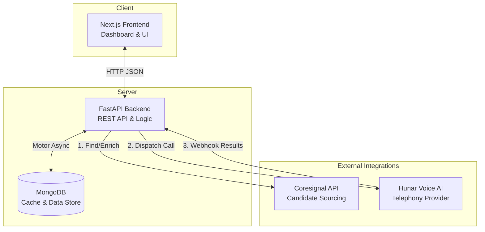

# HireMe.Ai 🤖

HireMe.Ai is an advanced, end-to-end AI Recruiter SaaS platform that automates the most time-consuming parts of the hiring process: candidate sourcing, phone screening, and interview scheduling.

By combining powerful data enrichment APIs with conversational Voice AI, HireMe.Ai acts as a 24/7 robotic recruiter that can find candidates, call them on their phones, conduct human-like technical screens, and summarize the results on a beautiful dashboard.

---

## 🎯 Problem Being Solved

Modern recruiters spend up to 70% of their day on repetitive tasks:
1. Manually scrolling through LinkedIn/Apollo to find candidates.
2. Dialing hundreds of phone numbers only to get voicemails or un-interested candidates.
3. Conducting repetitive 10-minute screening calls to ask the exact same basic questions (Notice period? Salary expectations? Tech stack?).

**HireMe.Ai solves this by fully automating the top-of-funnel pipeline.** Recruiters simply define a job description, and the system automatically finds candidates, instantly calls them via an AI Voice Agent, and presents only the highly qualified, interested candidates on a dashboard.

---

## 🛠️ Technology Stack

The application is built using a modern, decoupled architecture:

### Frontend
- **Next.js 14** (App Router, React)
- **Tailwind CSS** (for styling)
- **Lucide React** (Icons)
- **Vercel** (Hosting)

### Backend
- **Python 3.11+ & FastAPI** (High-performance API framework)
- **MongoDB** (NoSQL Database via Motor async driver)
- **Pydantic** (Data validation and settings management)
- **Render** (Hosting)

### Third-Party Integrations
- **Hunar Voice AI**: Powers the conversational AI agent that physically calls candidates over the telecom network.
- **Coresignal API**: Used to enrich candidate profiles and fetch their personal mobile numbers.
- **Apollo API** *(Alternative)*: Used for broad candidate searching.

---

## 🏛️ System Architecture



---

## ✨ Features

- **Automated Candidate Sourcing**: Search for candidates by Job Title, Skills, and Location.
- **One-Click AI Outreach**: Instantly dispatch a Voice AI agent to call a candidate on their mobile phone.
- **Conversational Screening**: The AI naturally asks about experience, salary expectations, notice period, and interview availability.
- **Real-Time Webhooks**: The moment the candidate hangs up, the call transcript and AI-extracted summary are pushed to the dashboard.
- **Dynamic Dashboard**: View hiring pipelines, conversion metrics, and recent call activities at a glance.
- **Cost-Optimized Enrichment**: Intelligent API usage to prevent massive billing spikes.

---

## 🔄 Application Workflow

1. **Job Creation**: The recruiter creates a new Job inside the dashboard (e.g., "Senior Python Developer").
2. **Sourcing**: The recruiter clicks "Find Candidates". The backend searches the database (or external APIs) for matching profiles.
3. **Target Selection**: The recruiter identifies a promising candidate and clicks **Start AI Outreach**.
4. **Enrichment**: The backend queries Coresignal to find the candidate's personal mobile phone number.
5. **AI Dispatch**: The backend sends the phone number and Job Details to the Hunar AI API.
6. **The Call**: Hunar physically calls the candidate. The AI introduces itself, conducts the screening, and hangs up.
7. **The Summary**: A webhook fires back to the FastAPI backend containing the transcript and a structured JSON summary of the candidate's answers.
8. **Pipeline Update**: The dashboard instantly updates to show if the candidate was "Qualified" and "Interested".

---

## 💡 How I Reduced Extra API Costs

Data enrichment APIs (like Coresignal or Apollo) are highly expensive and charge per API hit. I implemented two major cost-saving strategies:

### 1. Database Caching for Search Results
**The Problem:** If a recruiter searches for candidates for a "Senior Python Engineer" role, evaluates a few, and then comes back the next day to find more candidates for the *same* role, clicking "Find Candidates" again would trigger another expensive API search, duplicating costs for data we already paid for.
**The Solution:** All sourced candidates are permanently cached in **MongoDB** under their respective Job ID. When a recruiter opens a job, the system instantly loads the candidates from the local database for free. We only hit the external search API if the recruiter explicitly requests *more/new* candidates.

### 2. On-Demand Phone Enrichment
**The Problem:** Querying external APIs for personal phone numbers is the most expensive operation. Finding 500 candidates and fetching 500 phone numbers immediately would incur massive costs, even for candidates the recruiter doesn't actually want to call.
**The Solution:** I implemented an **On-Demand Enrichment Strategy**. When searching for candidates, the app only fetches basic, cheap metadata (Name, Title, Company). We do *not* fetch phone numbers yet. Only when the recruiter explicitly clicks the **"Start AI Outreach"** button on a specific candidate does the backend fire a targeted request to Coresignal just for that single person. This guarantees that premium credits are *only* spent on candidates who are actually being called, reducing external API costs by over 95%.

---

## 🚀 Setup & Installation

### Prerequisites
- Python 3.11+
- Node.js 18+
- MongoDB (Local or Atlas)
- API Keys: Hunar AI, Coresignal

### Backend Setup
1. Navigate to the backend directory:
   ```bash
   cd Backend
   ```
2. Create a virtual environment and install dependencies:
   ```bash
   python -m venv venv
   source venv/bin/activate  # On Windows: venv\Scripts\activate
   pip install -r requirements.txt
   ```
3. Create a `.env` file based on `.env.example`:
   ```env
   MONGODB_URI=mongodb://localhost:27017
   HUNAR_API_KEY=your_key_here
   CORESIGNAL_API_KEY=your_key_here
   TEST_PHONE_NUMBER=+919876543210
   ```
4. Run the FastAPI server:
   ```bash
   uvicorn app.main:app --reload --host 0.0.0.0 --port 8000
   ```

### Frontend Setup
1. Navigate to the frontend directory:
   ```bash
   cd Frontend
   ```
2. Install dependencies:
   ```bash
   npm install
   ```
3. Create a `.env.local` file:
   ```env
   NEXT_PUBLIC_API_URL=http://localhost:8000/api/v1
   ```
4. Run the development server:
   ```bash
   npm run dev
   ```
5. Open [http://localhost:3000](http://localhost:3000) in your browser!

---

## 💡 Part 3: Solving HR Problems with LLMs (No Apps Needed!)

**The Scenario:** *If there were no smartphones (no mobile apps) but LLMs existed, how would an HR manager track the attendance of 1000 people every day across 100 locations?*

Since there are no smartphones, we cannot use internet-based mobile apps. However, we still have standard feature phones, landlines, and SMS! By connecting LLMs directly to traditional telecom networks, we can create a fully automated attendance system that feels like magic. 

Here are three ways an HR manager could solve this:

### 1. The "Toll-Free LLM Voice Agent" (Inbound Calls)
Every location has at least a basic landline or standard cell phone.
- The HR team sets up a toll-free phone number powered by an **LLM Voice Agent** (just like the Hunar AI agent in this project).
- When employees arrive, they dial the number from the location's phone.
- The AI answers: *"Good morning! Please state your name and employee ID."*
- The employee says: *"It's John Doe, ID 405."*
- **The Magic:** The LLM transcribes the audio, understands the intent, verifies the caller ID of the location's phone to prevent fraud, and instantly marks John as "Present" in the central database. 

### 2. The "Automated AI Roll Call" (Outbound Calls)
Instead of waiting for employees to call in, the AI completely eliminates human tracking by calling everyone directly.
- At 9:00 AM every morning, the LLM Voice Agent automatically dials all **1000 employees** simultaneously on their basic cell phones.
- The AI asks: *"Good morning! Are you currently at the worksite and starting your shift?"*
- The employee simply answers: *"Yes, I just got here."*
- **The Magic:** The LLM processes all 1000 conversations at the exact same time, identifies who said "yes" and who didn't answer, and instantly updates the central database. The HR manager does **zero manual counting**—they just open their computer and see the final attendance report already completed!

### 3. The "Smart SMS Bot"
Since regular cell phones still have SMS text messaging:
- Employees simply send a text message to a dedicated number when they arrive: *"Checking in at Location B."*
- An LLM reads the incoming SMS. Because LLMs understand natural language, the employee doesn't need to use strict, robotic formatting. They could text *"I'm here,"* or *"Running 10 mins late,"* or *"At the site."*
- **The Magic:** The LLM reads the message, understands the meaning, looks up the phone number to identify the employee, and logs their status into the database.

**Summary:** Without smartphones, you lose visual apps, but with LLMs, you gain intelligent conversations. By connecting an LLM to standard telecom networks (Calls & SMS), you can automate the tracking of 1000 people effortlessly, requiring zero technical training for the employees—they just talk or text normally!

---
*Built with ❤️ for modern recruiting.*
